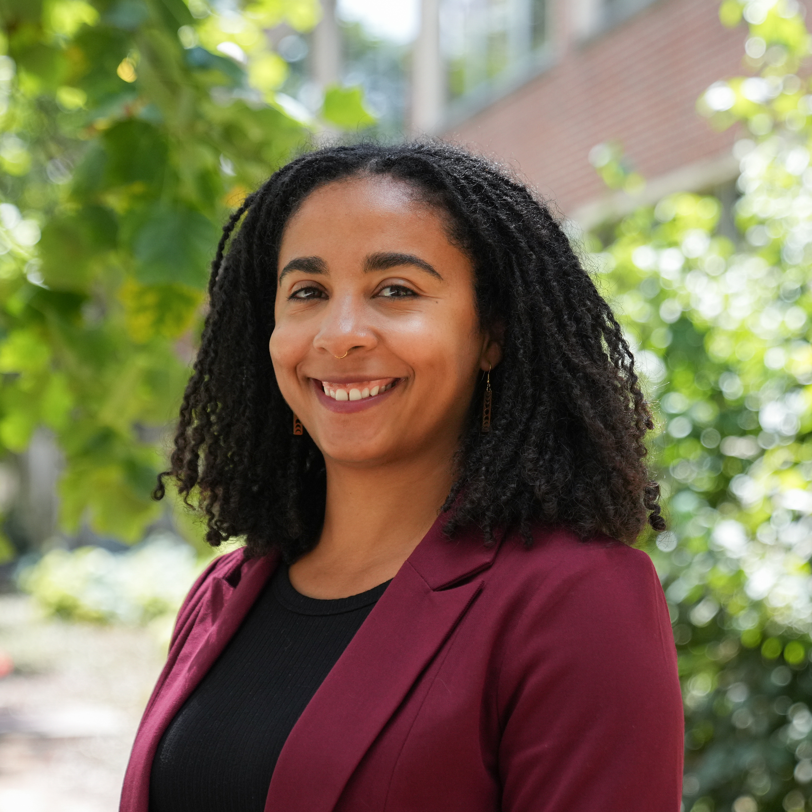

::: {.hero}
::: {.hero-text}
[Assistant Professor of Political Science · University of Michigan]{.eyebrow}

# Shea Streeter

[I study why some acts of state violence become public movements — and why so many others never do.]{.lead}

<a class="btn-brand" href="research.qmd">Read the research</a>
&nbsp;
<a class="btn-ghost" href="data/police-killings.qmd">Explore the data</a>

:::

::: {.portrait}
{fig-alt="Portrait of Shea Streeter"}
:::
:::

## About

I am a political scientist who studies race, police violence, and the politics of accountability in the United States. My research asks a question that scholarship has largely left unanswered: why do some police killings ignite protest and demands for justice while others pass in silence? I argue that the answer begins with families. The decisions that grieving families make in the aftermath of a killing — whether to mourn privately or to demand justice publicly — determine when private loss becomes public movement. This reframing changes how we understand the Black Lives Matter movement, revealing that campaigns for police accountability have been carried, in large part, on the labor of grieving relatives.

My book project, *Private Tragedy, Public Movement: Families and the Demand for Police Accountability*, develops and tests this argument. I draw on the Police Killings and Protest (PKAP) dataset, an original resource that documents more than 3,000 police killings and codes each for whether it produced protest. I pair that quantitative evidence with interviews and fieldwork among the families of people killed by police, a population that existing research has rarely reached. Together, these sources let me build a three-part theory of grievance, bandwidth, and broadcast that explains how a single death can become a national cause. I direct the Violence and Policing Lab at Michigan, where a team of graduate and undergraduate researchers helps build and analyze this evidence.

My earlier and ongoing work examines state violence and its political consequences from several angles. In the *Journal of Politics*, I showed that racial disparities in police killings persist even after accounting for the circumstances of each encounter. In *Public Opinion Quarterly*, my coauthor and I demonstrated that Americans' judgments about police violence turn on whether they perceive the victim as deserving. In a working paper on the 2020 uprising, my collaborator and I find that a county's prior protest experience, not its rate of police violence, best predicts whether residents mobilized after George Floyd's murder. Across these projects, I trace how communities translate — or fail to translate — violence into political action.

::: {.notebox}
**The data.** Much of my work builds on the Police Killings and Protest (PKAP) dataset, which I assemble and code with the Violence and Policing Lab. The interactive [police-killings explorer](data/police-killings.qmd) lets you examine these cases yourself. Each row represents a real death; I present the data soberly and with explicit attention to its limitations.
:::

## Elsewhere

I hold a Ph.D. in Political Science from Stanford University and a B.A. in Anthropology from the University of Notre Dame. Before joining the Michigan faculty, I was a President's Postdoctoral Fellow at Michigan. You can find my publications on [Google Scholar](https://scholar.google.com/citations?user=q2j799YAAAAJ&hl=en){target="_blank"}, download my [CV](cv.qmd), or [reach me by email](#){.email-obf data-user="sashea" data-domain="umich.edu"}.
